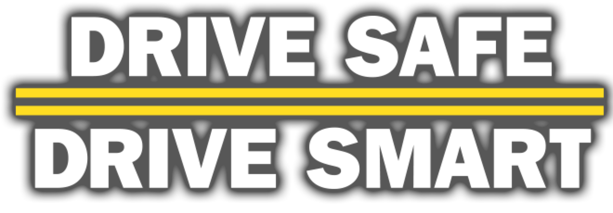

```{r setup, include=FALSE}
knitr::opts_chunk$set(echo = TRUE)
```
<br />

 

<br />

* Car Collisions are associated with various complex factors. 
  + From our regression model, we found that *boroughs*, *precipitation levels*, *vehicles types*, and *holiday weekends* are significant covariates. 
  + However, it’s unexpected to see that *traffic signal*/*streetlight working conditions* and *weathers types other than raining* are not associated with car accidents numbers, which is against our original thinking. 

<br />

* We do find some very meaningful trends using our dataset. 
  + First, avoid accident prone **hours and holidays**. Accidents are more likely to happen during rush hours, while the most fatal ones happen early in the morning (6 o'clock) and at night (9 o’clock). Moreover, holiday weekends are more traffic prone. 
  + Second, have good **driving habits**. Keep safe distance and backing up safely are always the keys to prevent a large proportion of accidents. In addition, one should always pay special attention when changing lanes in Manhattan. 
  + Third, stay away from bad **weather**, as extreme accidents are likely to happen during heavy/moderate rain.
  + Fourth, don't drunk when you drive. After you finish eating and drinking in **restaurant**, call a taxi instead of trying to drive back home by yourself.

<br />

* There are also some shortages associated with the *Motor Vehicle Collisions* dataset. 
  + We faced issues of missing data and non uniform observation names when we are trying to analyze *contributing factors* and *vehicle types*. 
    + The second highest contributing factor is unspecified, but knowing the right *contributing factors* could play a crucial rule when trying to reduce car accident numbers. Also, most *vehicle types* are recorded in different ways, which increased the difficulty to classify them. Better conclusion could be drawn if better data collecting mechanism is adopted.  

<br />

We hope by doing this analysis, people could travel more safely and wisely in New York City. 


