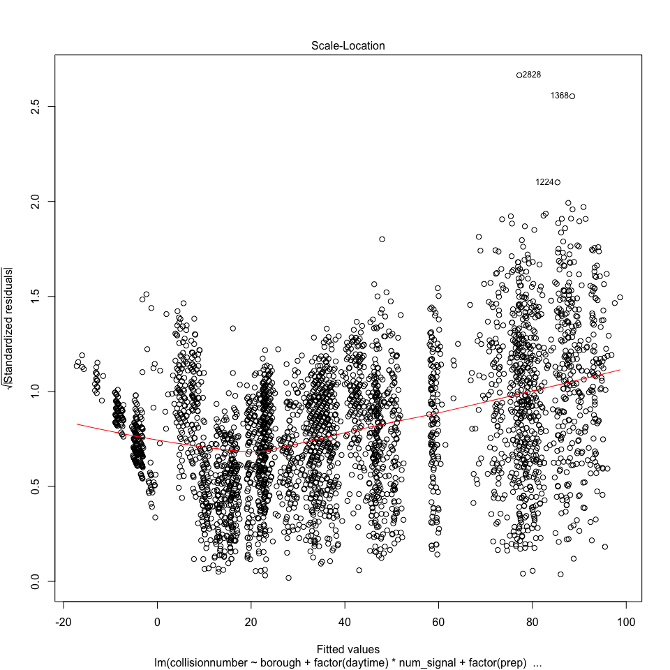

regression
================
Weijia Xiong
12/1/2019

``` r
data_2018 = 
  read_csv("./data/2018data.csv") %>% 
  janitor::clean_names() 
```

    ## Parsed with column specification:
    ## cols(
    ##   .default = col_character(),
    ##   TIME = col_time(format = ""),
    ##   `ZIP CODE` = col_double(),
    ##   LATITUDE = col_double(),
    ##   LONGITUDE = col_double(),
    ##   `NUMBER OF PERSONS INJURED` = col_double(),
    ##   `NUMBER OF PERSONS KILLED` = col_double(),
    ##   `NUMBER OF PEDESTRIANS INJURED` = col_double(),
    ##   `NUMBER OF PEDESTRIANS KILLED` = col_double(),
    ##   `NUMBER OF CYCLIST INJURED` = col_double(),
    ##   `NUMBER OF CYCLIST KILLED` = col_double(),
    ##   `NUMBER OF MOTORIST INJURED` = col_double(),
    ##   `NUMBER OF MOTORIST KILLED` = col_double(),
    ##   COLLISION_ID = col_double()
    ## )

    ## See spec(...) for full column specifications.

``` r
newnames = colnames(data_2018) %>% 
  str_replace("number_of_","") 
names(data_2018) = newnames

tidy_data = 
data_2018 %>% 
  mutate(
    date_complete = date 
  ) %>% 
  separate(date, into = c("month", "day", "year"), sep = "/") %>% 
  separate(time, into = c("hour", "minute"), sep = ":") %>%
  select(-zip_code, -location, -on_street_name, -cross_street_name, -off_street_name,-collision_id,-year) %>% 
  rename("vehicle_type" = "vehicle_type_code_1",
          "cause" = "contributing_factor_vehicle_1") %>% 
  mutate( day = as.numeric(day),
          month = as.numeric(month),
          hour = as.numeric(hour),
          minute = as.numeric(minute),
          latitude = replace_na(latitude,0),
          vehicle_type = str_to_lower(vehicle_type)
  ) %>%
  filter( latitude != 0) %>% 
  drop_na(borough)
```

## Weather data

``` r
climate_df = 
  read_csv("./large_data/climate.csv") %>% 
  janitor::clean_names() %>% 
  select(date,hourly_dry_bulb_temperature,hourly_precipitation,daily_weather) %>%
  separate(date, into = c("date", "time"), sep = " ") %>% 
  mutate(
    date = as.Date(date)
  )
```

    ## Parsed with column specification:
    ## cols(
    ##   .default = col_double(),
    ##   DATE = col_datetime(format = ""),
    ##   REPORT_TYPE = col_character(),
    ##   BackupDirection = col_logical(),
    ##   BackupDistance = col_logical(),
    ##   BackupDistanceUnit = col_logical(),
    ##   BackupElements = col_logical(),
    ##   BackupElevation = col_logical(),
    ##   BackupElevationUnit = col_logical(),
    ##   BackupEquipment = col_logical(),
    ##   BackupLatitude = col_logical(),
    ##   BackupLongitude = col_logical(),
    ##   BackupName = col_logical(),
    ##   DailyPeakWindDirection = col_character(),
    ##   DailyPrecipitation = col_character(),
    ##   DailySnowDepth = col_character(),
    ##   DailySnowfall = col_character(),
    ##   DailySustainedWindDirection = col_character(),
    ##   DailyWeather = col_character(),
    ##   HeavyFog = col_logical(),
    ##   HourlyPrecipitation = col_character()
    ##   # ... with 29 more columns
    ## )

    ## See spec(...) for full column specifications.

``` r
all_day_weather_df =
  climate_df %>% filter(time == "23:59:00") %>% 
  distinct(date,daily_weather) %>% 
  filter(!duplicated(date)) %>% 
  separate(daily_weather, into = c("weathertype", "other"), sep = 2) %>%
  mutate(
    weathertype = recode(weathertype,
                      "SN" = "snow",
                      "HZ" = "haze",
                      "RA" = "rain",
                      "FG" = "fog",
                      "BR" = "mist"
                      ),
    weathertype = replace_na(weathertype,"sunny")) %>% 
  select(-other)

daily_weather_df = 
climate_df %>% 
  separate(time, into = c("hour", "minute","second"), sep = ":") %>% 
  separate(date, into = c("year","month", "day"), sep = "-") %>% 
  separate(hourly_precipitation, into = c("prep","other"), sep = 4) %>% 
  select(-minute,-second,-year,-daily_weather,-other) %>% 
  mutate(
    month = as.numeric(month),
    day = as.numeric(day),
    hour = as.numeric(hour),
    prep = replace_na(as.numeric(prep),0)
  )
```

## Light data

``` r
light_data = 
  read_csv("./large_data/whole_accident.csv") %>% 
  select(-X1)
```

    ## Parsed with column specification:
    ## cols(
    ##   X1 = col_double(),
    ##   day = col_double(),
    ##   month = col_double(),
    ##   borough = col_character(),
    ##   num_accident = col_double(),
    ##   num_signal = col_double()
    ## )

## Vehicle data

``` r
vehicle_type_data = 
  tidy_data %>% 
  mutate(
    vehicle_type = replace(vehicle_type,str_detect(vehicle_type,"truck"),"truck"),
    vehicle_type = replace(vehicle_type,str_detect(vehicle_type,"sport utility"),"sport utility vehicle"),
    vehicle_type = replace(vehicle_type, vehicle_type %in% c("taxi","passenger vehicle","sedan","truck","sport utility vehicle") == FALSE, "others"),
    daytime = if_else(hour %in% 8:20,"1","0")
  ) 
```

## Regression

``` r
boro_hour_collision = 
tidy_data %>%
  group_by(borough,month,day,hour) %>%
  summarise(
    collisionnumber = mean(n())
  )
```

## hour by 2 category

``` r
boro_daytime_collision = 
  tidy_data %>%  
  mutate(
    daytime = if_else(hour %in% 8:20,"1","0")
  ) %>% 
  group_by(borough,month,day,daytime) %>%
  summarise(
    collisionnumber = mean(n())
  )
```

### weather

``` r
weathertype =
  all_day_weather_df %>% 
  separate(date, sep = '-',into = c("year","month","day")) %>% 
  select( -year)

weather_rep = 
weathertype[rep(seq_len(nrow(weathertype)), each = 2,5), ] %>% 
  mutate(
    borough = rep(c("BRONX", "BROOKLYN","MANHATTAN","QUEENS", "STATEN ISLAND"),each = 365*2),
    daytime = as.factor(rep(rep(0:1,365),5)),
    month = as.numeric(month),
    day = as.numeric(day),
  ) %>% 
  select(borough,month,day,daytime,weathertype)
  
boro_daytime_weather = 
left_join(boro_daytime_collision, weather_rep, by = c('borough','month','day','daytime'))

prep_data =
daily_weather_df %>% 
  mutate(
    daytime = if_else(hour %in% 8:20,"1","0")
  ) %>% 
  group_by(month,day,daytime) %>%
  summarise(
    prep = if_else(sum(prep) > 0, "1","0")
  )

boro_daytime_weather = 
  left_join(boro_daytime_weather,prep_data,by = c('month','day','daytime'))
```

### lights

``` r
boro_daytime_weather_light =
  left_join(boro_daytime_weather,light_data,by = c("month","day","borough")) %>% 
  select(-num_accident)
```

## vehicle

``` r
vehicle_data = 
vehicle_type_data %>% 
  group_by(borough,month,day,daytime) %>% 
  summarise(
    vehicle = names(which.max(table(vehicle_type)))
  ) 
boro_daytime_weather_light_vt = left_join(boro_daytime_weather_light, vehicle_data,by = c('borough','month','day','daytime'))
```

## holiday

``` r
boro_daytime_weather_light_vt_hol = 
  boro_daytime_weather_light_vt %>% 
  mutate(date_complete = paste(month,day, "2018",sep = "/"),
         holiday = c(0),
         holiday = replace(holiday, date_complete == "1/15/2018" | date_complete == "1/13/2018" | date_complete == "1/14/2018", "1"),
         holiday = replace(holiday, date_complete == "2/17/2018" | date_complete == "2/19/2018" | date_complete == "2/18/2018", "1"),
         holiday = replace(holiday, date_complete == "5/28/2018" | date_complete == "5/26/2018" | date_complete == "5/27/2018", "1"),
         holiday = replace(holiday, date_complete == "7/4/2018" | date_complete == "7/7/2018" | date_complete == "7/8/2018", "1"),
         holiday = replace(holiday, date_complete == "9/3/2018" | date_complete == "9/1/2018" | date_complete == "9/2/2018", "1"),
         holiday = replace(holiday, date_complete == "11/22/2018" | date_complete == "11/23/2018" | date_complete == "11/24/2018" | date_complete == "11/25/2018", "1"),
         holiday = replace(holiday, date_complete == "12/25/2018" | date_complete == "12/26/2018" | date_complete == "12/27/2018", "1"),
         holiday = as.factor(holiday),
         weathertype = as.factor(weathertype),
         vehicle = as.factor(vehicle)
         ) %>% 
  ungroup() %>% 
  select(-date_complete) %>% 
  select(collisionnumber,borough,everything())
```

``` r
fit2 = lm(collisionnumber ~ borough + factor(daytime)*num_signal + factor(prep) + vehicle + holiday, data = boro_daytime_weather_light_vt_hol) 

summary(fit2) %>% 
  broom::tidy() %>% 
  knitr::kable()
```

| term                         |     estimate | std.error |    statistic |   p.value |
| :--------------------------- | -----------: | --------: | -----------: | --------: |
| (Intercept)                  |   20.9843539 | 2.9436114 |    7.1287785 | 0.0000000 |
| boroughBROOKLYN              |   32.0670618 | 0.9308051 |   34.4508887 | 0.0000000 |
| boroughMANHATTAN             |    8.5160345 | 1.0212699 |    8.3386718 | 0.0000000 |
| boroughQUEENS                |   24.1236608 | 0.8429766 |   28.6172373 | 0.0000000 |
| boroughSTATEN ISLAND         | \-21.8717485 | 0.7834045 | \-27.9188436 | 0.0000000 |
| factor(daytime)1             |   26.4143686 | 0.7676066 |   34.4113365 | 0.0000000 |
| num\_signal                  |  \-0.0234120 | 0.0020170 | \-11.6071313 | 0.0000000 |
| factor(prep)1                |    1.1522721 | 0.5072893 |    2.2714298 | 0.0231795 |
| vehiclepassenger vehicle     |  \-7.0131210 | 2.9122619 |  \-2.4081354 | 0.0160840 |
| vehiclesedan                 |  \-3.1951372 | 2.8997003 |  \-1.1018853 | 0.2705848 |
| vehiclesport utility vehicle |  \-3.4489274 | 2.9294879 |  \-1.1773141 | 0.2391476 |
| vehicletaxi                  |    4.8533443 | 3.6786163 |    1.3193396 | 0.1871391 |
| vehicletruck                 |  \-0.1892060 | 6.9711662 |  \-0.0271412 | 0.9783486 |
| holiday1                     |  \-8.4159468 | 0.9936143 |  \-8.4700342 | 0.0000000 |
| factor(daytime)1:num\_signal |    0.0541657 | 0.0019682 |   27.5199058 | 0.0000000 |

``` r
plot(fit2)
```



``` r
cor(
  cbind(collisionnumber = pull(boro_daytime_weather_light_vt_hol,collisionnumber),
        model.matrix(collisionnumber ~ borough + daytime + weathertype + num_signal + vehicle + holiday +prep, boro_daytime_weather_light_vt_hol)[,-1])
  ) %>% 
  corrplot(method = "color", addCoef.col = "black", tl.col = "black", tl.srt = 45, insig = "blank" , number.cex = 0.7, diag = FALSE)
```


