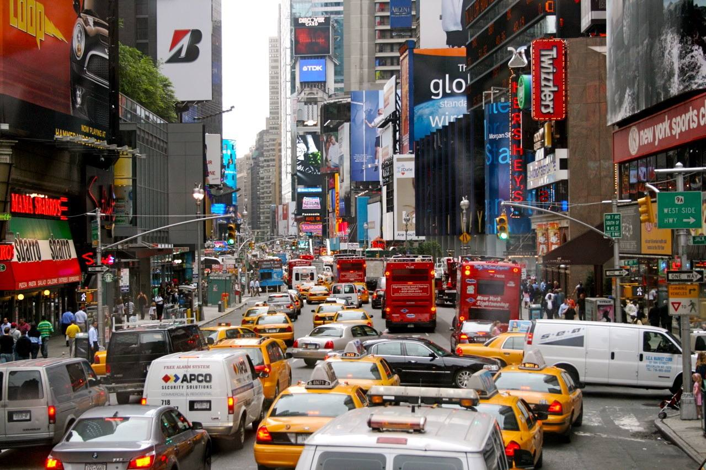

 

### **Motivation**
According to [Driver knowledge](https://www.driverknowledge.com/car-accident-statistics/#:~:targetText=U.S.%20every%20year%20is%206,experience%20permanent%20injuries%20every%20year.), there are around 6 million car accidents in the U.S every year on average, more than 90 people die in accidents everyday. The severity of car accidents raised our attention to find factors impacting number of car accidents. Through this report, we try to explore the association between accident number and weather, time of the day, holidays, number of borken street lights or traffic lights and number of restaurants in a certain area. We hope anyone who view our website will retrieve some useful information, in the meanwhile, raise security awareness.

 

### **Methods**

Data from five sources were considered for this project. The data sources, scraping methods and cleaning procedures for each dataset are described below. 

*  The Github repository for this project can be found [here](https://github.com/wx2233/p8105_final_project). 

*  The final website can be found [here](https://wx2233.github.io/p8105_final_project/)

* The shiny repository can be found [here](https://wx2233-shiny.shinyapps.io/final_shiny_dashboard/)

 

### **Data**
***NYPD Motor Vehicle Collisions-Crashes Data*** is from the [NYC Open Data](https://data.cityofnewyork.us/Public-Safety/Motor-Vehicle-Collisions-Crashes/h9gi-nx95). NYC Open Data is free public data published by New York City agencies and other partners. The Motor Vehicle Collisions data tables contain information from all police reported motor vehicle collisions in NYC. The police report [MV104-AN](https://www.nhtsa.gov/sites/nhtsa.dot.gov/files/documents/ny_overlay_mv-104an_rev05_2004.pdf) is required to be filled out for collisions where someone is injured or killed, or where there is at least $1000 worth of damage.

***DOHMH New York City Restaurant Inspection Results Data*** was obtained from the [NYC Open Data](https://data.cityofnewyork.us/Health/DOHMH-New-York-City-Restaurant-Inspection-Results/43nn-pn8j). The dataset was used to assess the association between the restaurant number and alcohol involved collision cases 

Data on ***U.S legal holidays*** was taken from the [Federal Holidays](https://www.redcort.com/us-federal-bank-holidays/).Federal holidays may affect the number of accidents since number of people going outside varies among holidays.  

***Traffic Signals Data*** is uploaded from [NYC Open Data](https://data.cityofnewyork.us/Transportation/DOT-Street-Lights-and-Traffic-Signals-311-Service-/jwvp-gyiq). This dataset contains all 311 Service Requests from 2010 to present which is automatically updated daily. Also, details related to services were included. 311 is a non-emergency phone number that people can call in many cities to find information about services, make complaints, or report problems like graffiti or road damage.

***Weather Data*** was taken from [National Centers For Environmental Information](https://www.ncdc.noaa.gov/cdo-web/search). It was used to figure out the influences given by different weather types, such as fog, sunny, mist etc,. Also, influences caused by levels of precipitation on accident events were also evaluated. 

 

### **Screencast**

The screencast below clearly shows the background, moethod, result and conclusion of our project.

<iframe width="560" height="315" src="https://www.youtube.com/embed/RDvGwWrEWo4" frameborder="0" allow="accelerometer; autoplay; encrypted-media; gyroscope; picture-in-picture" allowfullscreen></iframe>

 