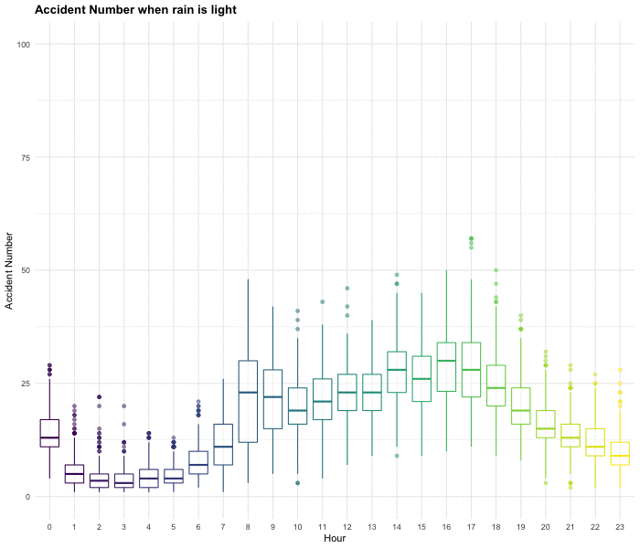

```{r setup, include=FALSE}
library(tidyverse)
library(plotly)
library(rvest)
library(readr)
library(kableExtra)
library(viridis)
library(leaflet)
library(patchwork)
library(RColorBrewer)
library(corrplot)
library(animation)
knitr::opts_chunk$set(
	echo = TRUE,
	warning = FALSE,
	fig.width = 8, 
  fig.height = 6,
  out.width = "80%",
	warning = FALSE,
	message = FALSE
)
options(
  ggplot2.continuous.colour = "viridis",
  ggplot2.continuous.fill = "viridis"
)
scale_colour_discrete = scale_colour_viridis_d
scale_fill_discrete = scale_fill_viridis_d
theme_set(theme_minimal() + theme(legend.position = "bottom",plot.title = element_text(face = "bold")))


```
## Exploring Factors Associated with Vehicle Collision in New York City

### **Motivation**
According to [Driver knowledge](https://www.driverknowledge.com/car-accident-statistics/#:~:targetText=U.S.%20every%20year%20is%206,experience%20permanent%20injuries%20every%20year.), there are around 6 million car accidents in the U.S every year on average, more than 90 people die in accidents everyday. The severity of car accidents raised our attention to find factors impacting number of car accidents. Through this report, we try to explore the association between accident number and weather, time of the day, holidays, number of borken street lights or traffic lights and number of restaurants in a certain area. We hope anyone who view our website will retrieve some useful information, in the meanwhile, raise security awareness.

### **Related Work**
Car accidents are the main cause of death in New York. And a lot of factors in daily life contribute to it. We get inspired from a variety of background sources on the influential factors of accident: 

[How Bad Weather Increases Driving Accidents](https://www.blumenshinelawgroup.com/how-bad-weather-increases-driving-accidents/)


[Facts About Restaurant Accidents](https://afterpersonalinjury.com/restaurant-accidents/)


[The deadliest holiday for car accidents](https://www.autoinsurance.org/can-you-guess-which-holiday-is-linked-to-the-most-fatal-crashes/)


[FATAL CAR COLLISION CAUSED BY INADEQUATE STREET LIGHTING](https://www.herrmanandherrman.com/blog/fatal-car-collision-caused-by-inadequate-street-lighting/)


### **Methods**

Data from five sources were considered for this project. The data sources, scraping methods and cleaning procedures for each dataset are described below. 

*  The Github repository for this project can be found [here](https://github.com/wx2233/p8105_final_project). 

*  The final website can be found [here](https://wx2233.github.io/p8105_final_project/)


### **Initial Questions**

* How accident number differ across New York City? Which areas have the highest concentrations of accident number?
* How have accident number changed over time and over hour in a day in 2018?
* How have accident number proportion changed over borough in a day in 2018?
* What are Top 10 causes of accident among different borough?
* Are there any differences between different types of vehicles for accident number over the hour?
* Does the number of accidents affect by level of precipitation? Which type of weather caused the highest number of accidents.
* Is there any association between alcohol involvement Accident and restaurant number?
* Whether there were more accidents on holidays and holiday weekend?
* What covariate contribute to the regression model?

### **Data**
***NYPD Motor Vehicle Collisions-Crashes Data*** is from the [NYC Open Data](https://data.cityofnewyork.us/Public-Safety/Motor-Vehicle-Collisions-Crashes/h9gi-nx95). NYC Open Data is free public data published by New York City agencies and other partners. The Motor Vehicle Collisions data tables contain information from all police reported motor vehicle collisions in NYC. The police report
[MV104-AN](https://www.nhtsa.gov/sites/nhtsa.dot.gov/files/documents/ny_overlay_mv-104an_rev05_2004.pdf) is required to be filled out for collisions where someone is injured or killed, or where there is at least $1000 worth of damage.

***DOHMH New York City Restaurant Inspection Results Data*** was obtained from the [NYC Open Data](https://data.cityofnewyork.us/Health/DOHMH-New-York-City-Restaurant-Inspection-Results/43nn-pn8j). The dataset was used to assess the association between the restaurant number and alcohol involved collision cases 

Data on ***U.S legal holidays*** was taken from the [Federal Holidays](https://www.redcort.com/us-federal-bank-holidays/).Federal holidays may affect the number of accidents since number of people going outside varies among holidays.  

***Traffic Signals Data*** is uploaded from [NYC Open Data](https://data.cityofnewyork.us/Transportation/DOT-Street-Lights-and-Traffic-Signals-311-Service-/jwvp-gyiq). This dataset contains all 311 Service Requests from 2010 to present which is automatically updated daily. Also, details related to services were included. 311 is a non-emergency phone number that people can call in many cities to find information about services, make complaints, or report problems like graffiti or road damage.

***Weather Data*** was taken from [National Centers For Environmental Information](https://www.ncdc.noaa.gov/cdo-web/search). It was used to figure out the influences given by different weather types, such as fog, sunny, mist etc,. Also, influences caused by levels of precipitation on accident events were also evaluated. 


### **Data cleaning**

**1. Collision Data**

NYPD Motor Vehicle Collisions-Crashes Data is from the NYC Open Data. NYC Open Data is free public data published by New York City agencies and other partners. The Motor Vehicle Collisions data tables contain information from all police reported motor vehicle collisions in NYC. The police report MV104-AN is required to be filled out for collisions where someone is injured or killed, or where there is at least $1000 worth of damage.

```{r message=FALSE, warning=FALSE}
data_2018 = 
  read_csv("./data/2018data.csv") %>% 
  janitor::clean_names() 
newnames = colnames(data_2018) %>% 
  str_replace("number_of_","") 
names(data_2018) = newnames

tidy_data = 
data_2018 %>% 
  mutate(
    date_complete = date 
  ) %>% 
  separate(date, into = c("month", "day", "year"), sep = "/") %>% 
  separate(time, into = c("hour", "minute"), sep = ":") %>%
  mutate(
    date_paste = as.Date(paste("2018",month,day,sep = "-"))
  ) %>% 
  select(-zip_code, -location, -on_street_name, -cross_street_name, -off_street_name,-collision_id,-year) %>% 
  rename("vehicle_type" = "vehicle_type_code_1",
         "cause" = "contributing_factor_vehicle_1") %>% 
  mutate( day = as.numeric(day),
          month = as.numeric(month),
          hour = as.numeric(hour),
          minute = as.numeric(minute),
          latitude = replace_na(latitude,0),
          vehicle_type = str_to_lower(vehicle_type)
  ) %>%
  filter( latitude != 0) %>% 
  drop_na(borough)
  
  
```

**2. Restaurant**

DOHMH New York City Restaurant Inspection Results Data was obtained from the NYC Open Data. The dataset was used to assess the association between the restaurant number and alcohol involved collision cases

```{r}
res = 
  read_csv("./large_data/nyc_inspec.csv") %>% 
  janitor::clean_names() 

res_filter= res %>% 
  select(dba, boro, zipcode) %>% 
  drop_na()
res_filter = plyr::rename(res_filter, c("boro" = "borough"))

res_count = res_filter%>% 
  group_by(zipcode, borough) %>% 
  summarise(
    res_count = n()
  ) %>% 
  mutate(
    borough = toupper(borough)
  )

data_location = data_2018 %>% 
filter(zip_code != "NA", location != "NA") %>% 
select(borough, collision_id, zip_code, location, contributing_factor_vehicle_1, contributing_factor_vehicle_2, contributing_factor_vehicle_3, contributing_factor_vehicle_4, contributing_factor_vehicle_5) %>% 
  filter(
contributing_factor_vehicle_1 == "Alcohol Involvement"|
contributing_factor_vehicle_2 == "Alcohol Involvement"| contributing_factor_vehicle_3 == "Alcohol Involvement"| contributing_factor_vehicle_4 == "Alcohol Involvement"| contributing_factor_vehicle_5 == "Alcohol Involvement")
data_location = plyr::rename(data_location, c("zip_code" = "zipcode"))

acci_count = data_location %>% 
  group_by(zipcode, borough) %>% 
  summarise(
    acci_count = n()
  )
```  


```{r include=FALSE}
res_acci_count = left_join(acci_count, res_count, by = "zipcode") %>%
  select(-borough.y) %>% 
   plyr::rename(c("borough.x" = "borough")) %>% 
  mutate(
     location = recode(zipcode,  `10460` = "Central Bronx",`10453` = "Central Bronx",`10457` = "Central Bronx",
`10458` = "Bronx Park and Fordham",`10467` = "Bronx Park and Fordham",`10468` = "Bronx Park and Fordham",
`10451` = "High Bridge and Morrisania",`10452` = "High Bridge and Morrisania",`10456` = "High Bridge and Morrisania",
`10454` = "Hunts Point and Mott Haven",`10455` = "Hunts Point and Mott Haven",`10459` = "Hunts Point and Mott Haven",`10474` = "Hunts Point and Mott Haven",
`10463` = "Kingsbridge and Riverdale",`10471` = "Kingsbridge and Riverdale",
`10466` = "Northeast Bronx",`10469` = "Northeast Bronx",`10470` = "Northeast Bronx",`10475` = "Northeast Bronx",
`10475` = "Southeast Bronx",`10475` = "Southeast Bronx",`10475` = "Southeast Bronx",`10475` = "Southeast Bronx",`10475` = "Southeast Bronx",`10475` = "Southeast Bronx",
`11212` = "	Central Brooklyn",`11213` = "	Central Brooklyn",`11216` = "	Central Brooklyn",`11233` = "	Central Brooklyn",`11238` = "	Central Brooklyn",
`11209` = "	Southwest Brooklyn",`11214` = "	Southwest Brooklyn",`11228` = "Southwest Brooklyn",
`11204` = "	Borough Park",`11218` = "	Borough Park",`11219` = "	Borough Park",`11230` = "	Borough Park",
`11234` = "	Canarsie and Flatlands",`11236` = "	Canarsie and Flatlands",`11239` = "Canarsie and Flatlands",
`11223` = "Southern Brooklyn",`11224` = "Southern Brooklyn",`11229` = "Southern Brooklyn",`11235` = "Southern Brooklyn",
`11201` = "Northwest Brooklyn",`11205` = "Northwest Brooklyn",`11215` = "Northwest Brooklyn",`11217` = "Northwest Brooklyn",`11231` = "Northwest Brooklyn",
`11203` = "Flatbush",`11210` = "Flatbush",`11225` = "Flatbush",`11226` = "Flatbush",
`11207` = "East New York and New Lots",`11208` = "East New York and New Lots",
`11211` = "Greenpoint",`11212` = "Greenpoint",
`11220` = "Sunset Park",`11232` = "Sunset Park",
`11206` = "Bushwick and Williamsburg",`11221` = "Bushwick and Williamsburg",`11237` = "Bushwick and Williamsburg",
`10026` = "	Central Harlem",`10027` = "	Central Harlem",`10030` = "	Central Harlem",`10037` = "	Central Harlem",`10039` = "Central Harlem",
`10001` = "	Chelsea and Clinton",`10011` = "Chelsea and Clinton",`10020` = "Chelsea and Clinton",`10018` = "Chelsea and Clinton",`10019` = "Chelsea and Clinton",`10036` = "Chelsea and Clinton",
`10029` = "East Harlem",`10035` = "East Harlem",
`10010` = "Gramercy Park and Murray Hill",`10016` = "Gramercy Park and Murray Hill",`10017` = "Gramercy Park and Murray Hill",`10022` = "Gramercy Park and Murray Hill",
`10012` = "Greenwich Village and Soho",`10013` = "Greenwich Village and Sohol",`10014` = "Greenwich Village and Soho",
`10004` = "Lower Manhattan",`10005` = "Lower Manhattan",`10006` = "Lower Manhattan",`10007` = "Lower Manhattan",`10038` = "Lower Manhattan",`10280` = "Lower Manhattan",
`10002` = "Lower East Side",`10003` = "Lower East Side",`10009` = "Lower East Side",
`10021` = "Upper East Side",`10028` = "Upper East Side",`10044` = "Upper East Side",`10065` = "Upper East Side",`10075` = "Upper East Side",`10128` = "Upper East Side",
`10023` = "Upper West Side",`10024` = "Upper West Side",`10025` = "Upper West Side",
`10031` = "Inwood and Washington Heights",`10032` = "Inwood and Washington Heights",`10033` = "Inwood and Washington Heights",`10034` = "Inwood and Washington Heights",`10040` = "Inwood and Washington Heights",
`11361` = "Northeast Queens",`11362` = "Northeast Queens",`11363` = "Northeast Queens",`11364` = "Northeast Queens",
`11354` = "North Queens",`11355` = "North Queens",`11356` = "North Queens",`11357` = "North Queens",`11358` = "North Queens",`11359` = "North Queens",`11360` = "North Queens",
`11365` = "Central Queens",`11366` = "Central Queens",`11367` = "Central Queens",
`11412` = "Jamaica",`11423` = "Jamaica",`11432` = "Jamaica",`11433` = "Jamaica",`11434` = "Jamaica",`11435` = "Jamaica",`11436` = "Jamaica",
`1101` = "Northwest Queens",`11102` = "Northwest Queens",`11103` = "Northwest Queens",`11104` = "Northwest Queens",`11105` = "Northwest Queens",`11106` = "Northwest Queens",
`11374` = "West Central Queens",`11375` = "West Central Queens",`11379` = "West Central Queens",`11385` = "West Central Queens",
`11691` = "Rockaways",`11692` = "Rockaways",`11693` = "Rockaways",`11694` = "Rockaways",`11695` = "Rockaways",`11697` = "Rockaways",
`11004` = "Southeast Queens",`11005` = "Southeast Queens",`11411` = "Southeast Queens",`11413` = "Southeast Queens",`11422` = "Southeast Queens",`11426` = "Southeast Queens",`11427` = "Southeast Queens",`11428` = "Southeast Queens",`11429` = "Southeast Queens",
`11415` = "Southwest Queens",`11416` = "Southwest Queens",`11417` = "Southwest Queens",`11418` = "Southwest Queens",`11419` = "Southwest Queenss",`11420` = "Southwest Queens",`11421` = "Southwest Queens",`11414` = "Southwest Queens",
`11368` = "West Queens",`11369` = "West Queens",`11370` = "West Queens",`11372` = "West Queens",`11373` = "West Queens",`11377` = "West Queens",`11378` = "West Queens",
`10302` = "Port Richmond",`10310` = "Port Richmond",`10303` = "Port Richmond",
`10306` = "South Shore",`10307` = "South Shore",`10308` = "South Shore",`10309` = "South Shore",`10312` = "South Shore",
`10301` = "Stapleton and St. George",`10304` = "Stapleton and St. George",`10305` = "Stapleton and St. George",
`10314` = "Mid-Island"
) 
  ) %>% 
  select(borough, everything()) %>% 
  arrange(borough) %>% 
  drop_na()
## save the result
## write.csv(res_acci_count,file = "./large_data/res_acci_count.csv")
```


**3. Traffic Lights**

Traffic Signals Data is uploaded from NYC Open Data. This dataset contains all 311 Service Requests from 2010 to present which is automatically updated daily. Also, details related to services were included. 311 is a non-emergency phone number that people can call in many cities to find information about services, make complaints, or report problems like graffiti or road damage.

```{r}
## number of broken light and signal per day
# traffic_street_light = read_csv(file = "./large_data/311_Service_Requests_from_2010_to_Present.csv") %>%
#   janitor::clean_names() %>%
#   select(created_date, closed_date, complaint_type, descriptor, incident_zip, borough, latitude, longitude) %>%
#   separate(created_date, into = c("created_month", "created_day", "created_year"), sep = "([\\/\\ \\:])") %>%
#   separate(closed_date, into = c("closed_month", "closed_day", "closed_year"), sep = "([\\/\\ \\:])") %>%
#   filter(created_year == 2018 | closed_year == 2018) %>%
#   mutate(created_day = as.numeric(created_day),
#          created_month = as.numeric(created_month),
#          created_year = as.numeric(created_year),
#          closed_day = as.numeric(closed_day),
#          closed_month = as.numeric(closed_month),
#          closed_year = as.numeric(closed_year))
# traffic_street_light = traffic_street_light %>%
#   filter(created_year == closed_year & ((created_month < closed_month)|(created_month == closed_month & created_day <= closed_day))) %>%
#   bind_rows(traffic_street_light %>% filter(created_year < closed_year))

```

```{r}
## combine data of accident and traffic signal
# 
# whole_accident = tidy_data %>%
#   drop_na(borough, month, day) %>%
#   group_by(day, month, borough) %>%
#   summarize(num_accident = n())
# signal = traffic_street_light %>%
#   filter(complaint_type == "Traffic Signal Condition") %>%
#   drop_na(created_year, closed_year, created_month, closed_month, created_day, closed_day, borough) 
# whole_accident = whole_accident %>% 
#   ungroup() %>%
#   mutate(num_signal = rep(0,nrow(whole_accident)))
# for (i in 1:nrow(whole_accident)){
#   day = whole_accident[i,] %>% pull(.,day)
#   month = whole_accident[i,] %>% pull(.,month)
#   year = 2018
#   
# borough1 = whole_accident[i,] %>% pull(.,borough)
#   filter_n = signal %>% 
#     filter(created_year == year & ((created_month < month)|(created_month == month & created_day <= day))) %>%
#     bind_rows(signal %>% filter(created_year < year)) 
#   filter_n = filter_n %>%
#     filter(year == closed_year & ((month < closed_month) |(month == closed_month & day <= closed_day))) %>%
#     bind_rows(filter_n %>% filter(year < closed_year)) %>%
#     filter(borough == borough1) %>%
#     nrow()
#   whole_accident[i,]$num_signal = filter_n
# }
## write.csv(whole_accident,file="./data/whole_accident.csv",append=F)
whole_accident = read_csv("./large_data/whole_accident.csv")
```


```{r}
## combine data of accident and street light
# night_accident = tidy_data %>%
#   drop_na(borough, month, day) %>%
#   filter(hour >= 18 | hour <= 5) %>%
#   group_by(day, month, borough) %>%
#   summarize(num_accident = n()) 
# night_accident_0 = left_join(whole_accident, night_accident, by = c("month","day","borough")) %>% 
#   filter(is.na(num_accident.y)) %>%
#   select(day, month, borough) %>%
#   mutate(num_accident = rep(0,4))
# night_accident = bind_rows(night_accident, night_accident_0)
# light = traffic_street_light %>%
#   filter(complaint_type == "Street Light Condition") %>%
#   drop_na(created_year, closed_year, created_month, closed_month, created_day, closed_day, borough) 
# night_accident = night_accident %>% 
#   ungroup() %>%
#   mutate(num_light = rep(0,nrow(night_accident)))
# for (i in 1:nrow(night_accident)){
#   day = night_accident[i,] %>% pull(.,day)
#   month = night_accident[i,] %>% pull(.,month)
#   year = 2018
#   borough1 = night_accident[i,] %>% pull(.,borough)
#   filter_n = light %>% 
#     filter(created_year == year & ((created_month < month)|(created_month == month & created_day <= day))) %>%
#     bind_rows(light %>% filter(created_year < year)) 
#   filter_n = filter_n %>%
#     filter(year == closed_year & ((month < closed_month) |(month == closed_month & day <= closed_day))) %>%
#     bind_rows(filter_n %>% filter(year < closed_year)) %>%
#     filter(borough == borough1) %>%
#     nrow()
#   night_accident[i,]$num_light = filter_n
# }
# write.csv(night_accident,file="./data/night_accident.csv",append=F)
night_accident = read_csv("./large_data/night_accident.csv")
```


**4. Weather**

Weather Data was taken from National Centers For Environmental Information. It was used to figure out the influences given by different weather types, such as fog, sunny, mist etc,. Also, influences caused by levels of precipitation on accident events were also evaluated.

```{r}
climate_df = 
  read_csv("./large_data/climate.csv") %>% 
  janitor::clean_names() %>% 
  select(date,hourly_dry_bulb_temperature,hourly_precipitation,daily_weather) %>%
  separate(date, into = c("date", "time"), sep = " ") %>% 
  mutate(
    date = as.Date(date)
  )
```


```{r}
all_day_weather_df =
  climate_df %>% filter(time == "23:59:00") %>% 
  distinct(date,daily_weather) %>% 
  filter(!duplicated(date)) %>% 
  separate(daily_weather, into = c("weathertype", "other"), sep = 2) %>%
  mutate(
    weathertype = recode(weathertype,
                      "SN" = "snow",
                      "HZ" = "haze",
                      "RA" = "rain",
                      "FG" = "fog",
                      "BR" = "mist"
                      ),
    weathertype = replace_na(weathertype,"sunny")) %>% 
  select(-other)

collision_all = 
tidy_data %>% 
  group_by(date_complete) %>% 
  summarise(
    collision_event = n(),
    injured_event = sum(persons_injured != 0, na.rm = TRUE),
    killed_event = sum(persons_killed != 0, na.rm = TRUE)
  )

collision_weather = 
bind_cols(all_day_weather_df,collision_all) %>% 
  select(-date_complete)
```


```{r}
daily_weather_df = 
climate_df %>% 
  separate(time, into = c("hour", "minute","second"), sep = ":") %>% 
  separate(date, into = c("year","month", "day"), sep = "-") %>% 
  separate(hourly_precipitation, into = c("prep","other"), sep = 4) %>% 
  select(-minute,-second,-year,-daily_weather,-other) %>% 
  mutate(
    month = as.numeric(month),
    day = as.numeric(day),
    hour = as.numeric(hour),
    prep = replace_na(as.numeric(prep),0)
  )
```


**5. Holiday**

Data on U.S legal holidays was taken from the Federal Holidays.Federal holidays may affect the number of accidents since number of people going outside varies among holidays.

```{r}
data_2018 = tidy_data

holiday_data = 
  data_2018 %>%
  select(date_complete, everything()) %>%
  mutate(holiday = "No Holiday") %>% 
  select(date_complete, holiday, everything()) %>% 
  mutate(holiday = replace(holiday, date_complete == "01/01/2018", "New Year's Day"), 
         holiday = replace(holiday, date_complete == "01/15/2018", "Martin Luther King, Jr. Day"),
         holiday = replace(holiday, date_complete == "01/13/2018"|date_complete =="01/14/2018", "Martin Luther King Day Weekend (2 days)"),
         holiday = replace(holiday, date_complete == "02/19/2018", "Presidents Day"),
         holiday = replace(holiday, date_complete == "02/17/2018"|date_complete =="02/18/2018", "Presidents Day Weekend (2 days)"),
         holiday = replace(holiday, date_complete == "05/28/2018", "Memorial Day"),
         holiday = replace(holiday, date_complete == "05/26/2018"|date_complete =="05/27/2018", "Memorial Day Weekend (2 days)"),
         holiday = replace(holiday, date_complete == "07/04/2018", "Independence Day"),
         holiday = replace(holiday, date_complete == "07/07/2018"|date_complete =="07/08/2018", "Independence Day Weekend (2 days)"),
         holiday = replace(holiday, date_complete == "09/03/2018", "Labor Day"),
         holiday = replace(holiday, date_complete == "09/01/2018"|date_complete =="09/02/2018", "Labor Day Weekend (2 days)"),
         holiday = replace(holiday, date_complete == "11/22/2018", "Thanksgiving Day"),
         holiday = replace(holiday, date_complete == "11/23/2018"|date_complete =="11/24/2018"|date_complete =="11/25/2018", "Thanksgiving Weekend (3 days)"),
         holiday = replace(holiday, date_complete == "12/25/2018", "Christmas Day"),
         holiday = replace(holiday, date_complete == "12/26/2018"|date_complete =="12/27/2018", "Christmas Day Weekend (2 days)")
         )
```


### **Exploratory Analysis**

```{r}
  tidy_data %>%  
  select(persons_injured, persons_killed) %>% 
  psych::describe() %>% 
  knitr::kable()

  bind_cols(
  num_accident =
    pull(whole_accident,num_signal),
  num_light = 
    pull(night_accident,num_light),
) %>% 
  psych::describe() %>% 
  knitr::kable()

  daily_weather_df %>%
  select(prep,hourly_dry_bulb_temperature)%>% 
  psych::describe() %>% 
  knitr::kable()

  res_acci_count %>%
  ungroup() %>% 
  select(acci_count,res_count) %>% 
  psych::describe() %>% 
  knitr::kable()
```


#### Vehicle type
```{r}
vehicle_type_data = 
  tidy_data %>% 
  mutate(
    vehicle_type = replace(vehicle_type,str_detect(vehicle_type,"truck"),"truck"),
    vehicle_type = replace(vehicle_type,str_detect(vehicle_type,"sport utility"),"sport utility vehicle"),
    vehicle_type = replace(vehicle_type, vehicle_type %in% c("taxi","passenger vehicle","sedan","truck","sport utility vehicle") == FALSE, "others")) %>% 
  group_by(vehicle_type,hour) %>% 
  summarize(
    n = n()
  )

vehicle_type_plot = 
vehicle_type_data %>% 
  ggplot(aes(x = hour, y = n, color = vehicle_type)) +
  geom_line() +
  labs(
    color = "vehicle type",
    title = "Collisions of Day for Different Vehicles",
    x = list(title = "Hour of Day"),
    y = list(title = "Collisions")
    )
  
vehicle_type_plot
```


#### Top 10 Collision Reasons
```{r}
df_cause =  
  tidy_data %>% 
  select(borough,cause) %>% 
      filter(!(cause %in% c('', 
                            'Unspecified', 
                            'Driver Inattention/Distraction',
                            'Other Vehicular',
                            'Failure to Yield Right-of-Way'))
             ) 
df_cause_top = 
  df_cause %>%
  group_by(cause) %>%
  summarise(count = n()) %>%
  top_n(10, count) %>% 
  ungroup() %>% 
  arrange(count)

cause_by_boro =  
  df_cause %>% 
  semi_join(., df_cause_top, by = "cause") %>%
  group_by(borough, cause) %>%
  summarise(count = n()) %>% 
  # reorder cause levels for desirable order in bar chart display:
  mutate(
    cause = factor(cause, levels = pull(df_cause_top,cause))
    ) 

cause_by_boro_all = 
  cause_by_boro %>% 
  group_by(borough) %>%
  summarise(total = sum(count))

cause_by_boro = 
  left_join(cause_by_boro, cause_by_boro_all, by = "borough") %>%
  mutate(ratio = count / total) %>%
  select(-count, -total) 

cause_by_boro_plot =
  cause_by_boro %>% 
  ggplot(aes(x = cause, y = ratio, fill = borough)) +
      geom_bar(width = 0.5, stat = 'identity', show.legend = F) +
      coord_flip() +
      facet_grid(.~borough) +
      labs(title = 'Collisions by Causes',
           x = NULL,
           y = NULL) +
  theme(axis.text.x = element_text(angle = 45))
cause_by_boro_plot
```

#### Mapping

```{r}
# data_2018 = tidy_data
# map_data = rename(data_2018, long = latitude, lat = longitude) 
# pal <- colorNumeric(
#   palette = "Accent",
#   domain = map_data$persons_injured)
# map_data %>% 
#   filter(persons_injured > 0) %>% 
#   filter(!(lat < "-70" | lat >= "-75")) %>% 
#   mutate(
#     label = str_c("<b>vehicle type: ", vehicle_type, "</b><br>Persons Injured: ", persons_injured , sep = "") ) %>%
#   leaflet() %>% 
#   addTiles() %>%
#   addProviderTiles(providers$CartoDB.Positron) %>% 
#   addLegend("bottomright", pal = pal, values = ~persons_injured,
#     title = "Persons Injured",
#     opacity = 1
#   ) %>% 
#   addCircleMarkers(
#     ~lat, ~long,
#     color = ~pal(persons_injured),
#     radius = 0.5,
#     popup = ~ label) 
```

```{r}
data_2018_seperate = tidy_data 
```


#### Association between Day and People Injured or killed or Accident Number

```{r, echo = FALSE}
data_acci_day = tidy_data %>% 
  group_by(date_paste) %>% 
  mutate(
    sum_acci = n()
  ) %>% 
  select(date_paste, sum_acci) %>% 
  distinct()

data_kill_injured_day = tidy_data %>% 
  group_by(date_paste) %>% 
  mutate(
    sum_injured = sum(persons_injured,na.rm = TRUE),
    sum_killed = sum(persons_killed,na.rm = TRUE)
  ) %>% 
  select(date_paste, sum_injured, sum_killed) %>% 
  distinct( ) 

data_day = cbind(data_acci_day, data_kill_injured_day) %>% 
  select(-date_paste1)
data_day= rename(data_day, 
                "accident number"  = "sum_acci",
                "people injured"  = "sum_injured" , 
                 "people killed" = "sum_killed" ,
                 "date" = "date_paste" ) 

data_day  = data_day %>% 
  pivot_longer(
    `accident number`:`people killed`,
    names_to   = "type",
    values_to = "number"
  )
```

```{r include=FALSE}
data_day %>%
  filter(type == "accident number") %>% 
  arrange(desc(number))

```

```{r}
plot_day =
  data_day %>% 
  ggplot(aes(x = date,y = number, color = type))+
  geom_line()+
  theme(
        axis.title = element_text(size=14,face="bold"),
        plot.title = element_text(hjust = 0.5,size=14,face="bold"))+
  labs(
   title = "Trend Over the Year",
   x = "Day of the Year",
   y = "Number") +
  annotate("text", x = as.Date("2018-11-15") , y = 695, label = "2018-11-15")

plot_day

```


#### proportion of accident and injured people by borough, by hour

```{r}
boro_events = 
  tidy_data %>% 
  drop_na(borough, persons_injured, persons_killed) %>%
  group_by(borough) %>%
  summarize(accident = n(),
            injured = sum(persons_injured),
            killed = sum(persons_killed)) %>%
  mutate(prop_accident = round(accident/sum(accident),4),
         prop_injured = round(injured/sum(injured),4),
         prop_killed = round(killed/sum(killed),4)) %>%
  pivot_longer(
    prop_accident:prop_killed,
    values_to = "proportion",
    names_prefix = "prop_",
    names_to = "events",
  ) 

boro_events_plot = 
  boro_events %>% 
  ggplot(aes(x = borough, y = proportion, fill = events)) +
  geom_bar(stat = "identity",position = "dodge") +
  labs(title ="proportion of accident and injured people by borough", 
       x = 'Borough',
       y = 'Proportion'
  )

boro_events_plot

```
Number of accident and injured people in Brooklyn is greatest comparing with other boroughs. Queen is second. Staten Island have fewest accident and injured people. Manhattan and Bronx is in the middle.


#### Proportion of accident and injured people by hour
```{r}
hour_events = 
  tidy_data %>% 
  drop_na(hour, persons_injured, persons_killed) %>%
  group_by(hour) %>%
  summarize(accident = n(),
            injured = sum(persons_injured),
            killed = sum(persons_killed)) %>%
  mutate(prop_accident = round(accident/sum(accident),4),
         prop_injured = round(injured/sum(injured),4),
         prop_killed = round(killed/sum(killed),4)) %>%
  pivot_longer(
    prop_accident:prop_killed,
    values_to = "proportion",
    names_prefix = "prop_",
    names_to = "events",
  ) 

hour_events_plot =
hour_events %>% 
  ggplot(aes(x = hour, y = proportion, color = events)) +
  geom_line() +
  annotate("rect", xmin = 8, xmax = 20, ymin = 0, ymax = Inf, fill = "blue", alpha = .1) +
  labs(
    title = "proportion of accident and injured people by hour", 
    x =  'Hour',
    y = 'Proportion')

hour_events_plot

```
Frequency of accident and injured people in the period of 8 am-20 pm is higher than other period of time. Started from 3 am, number of accident and injured people increase and reach a small peak at 8am. At 5pm, it reaches a big peak. then it started to decrease.

#### Holiday Analysis

  + If you want to know how many people went out on 2018 holidays, you can [click here](https://newsroom.aaa.com/2018/12/2018-busiest-holiday-travel-season-on-record/) for information.
  
  +  Select days in November and December are designated [Gridlock Alert Days](https://www.amny.com/transit/nyc-traffic-1-21176466/), as traffic volumes increase with holiday shopping and travel, as well as special event street closures. Drivers can expect that travel through Midtown will take twice as long as a typical day of week.
  

```{r}
holiday_data =
  holiday_data %>% 
  drop_na(persons_injured)

holiday_data %>% 
  group_by(holiday) %>% 
  summarise(total_injured = sum(persons_injured))

bronx = 
  holiday_data %>% 
  filter(borough == "BRONX") %>% 
  group_by(holiday) %>% 
  summarise(bronx_total_injured = sum(persons_injured))
brooklyn = 
  holiday_data %>% 
  filter(borough == "BROOKLYN") %>% 
  group_by(holiday) %>% 
  summarise(brooklyn_total_injured = sum(persons_injured)) %>% 
  select(brooklyn_total_injured)
manhattan = 
  holiday_data %>% 
  filter(borough == "MANHATTAN") %>% 
  group_by(holiday) %>% 
  summarise(manhattan_total_injured = sum(persons_injured))%>% 
  select(manhattan_total_injured)
queens = 
  holiday_data %>% 
  filter(borough == "QUEENS") %>% 
  group_by(holiday) %>% 
  summarise(queens_total_injured = sum(persons_injured))%>% 
  select(queens_total_injured)
staten_island = 
  holiday_data %>% 
  filter(borough == "STATEN ISLAND") %>% 
  group_by(holiday) %>% 
  summarise(staten_island_total_injured = sum(persons_injured))%>% 
  select(staten_island_total_injured)

holiday_borough = 
  cbind(bronx, brooklyn, manhattan, queens, staten_island) %>% 
  mutate(total = bronx_total_injured+brooklyn_total_injured+manhattan_total_injured+	queens_total_injured+staten_island_total_injured) %>% 
  filter(holiday!="No Holiday")

holiday_borough_day = 
  holiday_borough %>% 
  filter(holiday =="Christmas Day"|holiday =="Independence Day"|holiday =="Labor Day"|holiday =="Martin Luther King, Jr. Day"|holiday =="Memorial Day"|holiday =="New Year’s Day"|holiday =="Thanksgiving Day"|holiday =="Presidents Day")

holiday_borough_day = holiday_borough_day[order(holiday_borough_day$total),]

# On the day of the holiday

plot_day =
pivot_longer(
    holiday_borough_day, 
    bronx_total_injured:staten_island_total_injured,
    names_to = "borough", 
    values_to = "person_injured") %>% 
  ggplot(aes(x = reorder(holiday, -total), y = person_injured, fill = borough)) +
  geom_bar(stat="identity") +
  theme(legend.position = "right", axis.text.x = element_text(angle = 45)) +
  labs(
    title = "Persons Injured by Car Crashs \n on Federal Holidays (2018)",
    x = "Holiday",
    y = "# Persons Injured") +
  scale_fill_discrete(name = "Borough", labels = c("Bronx", "Brooklyn", "Manhattan", "Queens", "Staten Island"))
# scale_fill_discrete(name = "Borough", labels = c("Bronx", "Brooklyn", "Manhattan", "Queens", "Staten Island")) 
```


  
```{r}
data_2018 = tidy_data

holiday_data_weekend = 
  data_2018 %>%
  select(date_complete, everything()) %>%
  mutate(holiday = "No Holiday") %>% 
  select(date_complete, holiday, everything()) %>% 
  mutate(holiday = replace(holiday, date_complete == "01/15/2018"|date_complete == "01/13/2018"|date_complete =="01/14/2018", "Martin Luther King Day Weekend (3 days)"),
         holiday = replace(holiday, date_complete == "02/17/2018"|date_complete == "02/19/2018"|date_complete =="02/18/2018", "Presidents Day Weekend (3 days)"),
         holiday = replace(holiday, date_complete == "05/28/2018"|date_complete == "05/26/2018"|date_complete =="05/27/2018", "Memorial Day Weekend (3 days)"),
         holiday = replace(holiday, date_complete == "07/04/2018"|date_complete == "07/07/2018"|date_complete =="07/08/2018", "Independence Day Weekend (3 days)"),
         holiday = replace(holiday, date_complete == "09/03/2018"|date_complete == "09/01/2018"|date_complete =="09/02/2018", "Labor Day Weekend (3 days)"),
         holiday = replace(holiday, date_complete == "11/22/2018"|date_complete == "11/23/2018"|date_complete =="11/24/2018"|date_complete =="11/25/2018", "Thanksgiving Weekend (4 days)"),
         holiday = replace(holiday, date_complete == "12/25/2018"|date_complete == "12/26/2018"|date_complete =="12/27/2018", "Christmas Day Weekend (3 days)")
         )

holiday_data_weekend =
  holiday_data_weekend %>% 
  drop_na(persons_injured)

holiday_data_weekend %>% 
  group_by(holiday) %>% 
  summarise(total_injured = sum(persons_injured)) %>% 
  knitr::kable()

bronx = 
  holiday_data_weekend %>% 
  filter(borough == "BRONX") %>% 
  group_by(holiday) %>% 
  summarise(bronx_total_injured = sum(persons_injured))
brooklyn = 
  holiday_data_weekend %>% 
  filter(borough == "BROOKLYN") %>% 
  group_by(holiday) %>% 
  summarise(brooklyn_total_injured = sum(persons_injured)) %>% 
  select(brooklyn_total_injured)
manhattan = 
  holiday_data_weekend %>% 
  filter(borough == "MANHATTAN") %>% 
  group_by(holiday) %>% 
  summarise(manhattan_total_injured = sum(persons_injured))%>% 
  select(manhattan_total_injured)
queens = 
  holiday_data_weekend %>% 
  filter(borough == "QUEENS") %>% 
  group_by(holiday) %>% 
  summarise(queens_total_injured = sum(persons_injured))%>% 
  select(queens_total_injured)
staten_island = 
  holiday_data_weekend %>% 
  filter(borough == "STATEN ISLAND") %>% 
  group_by(holiday) %>% 
  summarise(staten_island_total_injured = sum(persons_injured))%>% 
  select(staten_island_total_injured)

holiday_borough_weekend = 
  cbind(bronx, brooklyn, manhattan, queens, staten_island) %>% 
  mutate(total = bronx_total_injured+brooklyn_total_injured+manhattan_total_injured+	queens_total_injured+staten_island_total_injured) %>% 
  filter(holiday!="No Holiday")

plot_weekend = 
pivot_longer(
    holiday_borough_weekend, 
    bronx_total_injured:staten_island_total_injured,
    names_to = "borough", 
    values_to = "person_injured") %>% 
  ggplot(aes(x = reorder(holiday, -total), y = person_injured, fill = borough)) +
  geom_bar(stat="identity") +
  theme(legend.position = "right", axis.text.x = element_text(angle = 45)) +
  labs(
    title = "Persons Injured by Car Crashs on \n Federal Holidays Weekends (2018)",
    x = "Holiday Weekends",
    y = "# Persons Injured") +
  scale_fill_discrete(name = "Borough", labels = c("Bronx", "Brooklyn", "Manhattan", "Queens", "Staten Island"))

plot_day + plot_weekend
```


Most persons injured cases happened on Labor Day and Labor Day weekend, while least number of persons injured cases was on Thanksgiving Day. However, Thanksgiving weekend was the second most holiday weekends when most persons are injured. It could be explained by that people tend to stay home on the day of thanksgiving, while most people might be out shopping on Thanksgiving weekend, which increases the number of persons injured. 

So try to avoid going out on Labor Day weekend and Thanksgiving week, and be careful if you have to. 

#### Weather

**Bad weather causes bad accident**

  + A weather-related accident is defined as one that occurs in any adverse condition such as sleet, snow, rain, fog, winds or on slick pavement.If you want to know how bad weather increases driving accidents, please [click here](https://www.blumenshinelawgroup.com/how-bad-weather-increases-driving-accidents/).
  
```{r out.width= "90%"}
weather_type_plot =  
collision_weather %>% 
  group_by(weathertype) %>% 
  summarise(
    count = mean(collision_event)
  ) %>% 
  mutate(
    weathertype = fct_reorder(weathertype,count)
  ) %>% 
  ggplot(aes(x = weathertype, y = count,
             fill = weathertype)) + 
  geom_bar(stat = "identity", width = 0.6) +
  coord_flip()+
  labs(
    title = " Number of Accident by weather",
    y = "Number of Accident",
    x = "Weather Type"
    )

weather_type_plot 
```

It is surprising to see that sunny weather is the third most common weather type when car accidents tend to happen. On the other hand, people might be going outside more on sunny days, which can cause an increase in car accidents. Accident number in this plot is strongly related to how likely people will go out under different weather conditions. More people being outside means more accidents. 


```{r message = FALSE, warning = FALSE}
daily_weather_df = 
climate_df %>% 
  separate(time, into = c("hour", "minute","second"), sep = ":") %>% 
  separate(date, into = c("year","month", "day"), sep = "-") %>% 
  separate(hourly_precipitation, into = c("prep","other"), sep = 4) %>% 
  select(-minute,-second,-year,-daily_weather,-other) %>% 
  mutate(
    month = as.numeric(month),
    day = as.numeric(day),
    hour = as.numeric(hour),
    prep = replace_na(as.numeric(prep),0)
  )

daily_weather_final = daily_weather_df[rep(seq_len(nrow(daily_weather_df)), each = 3), ]

daily_collision_data = 
tidy_data %>% 
  select(month,day,hour,persons_injured,persons_killed) %>% 
  group_by(month,day,hour) %>% 
  summarise(
    accident = n(),
    injured = sum(persons_injured,na.rm = TRUE),
    killed = sum(persons_killed,na.rm = TRUE)
  ) %>% 
  pivot_longer(
    accident:killed,
    names_to = "type",
    values_to = "number"
  )

daily_weather_collision = 
  left_join(daily_collision_data, daily_weather_df,
            by = c("month","day","hour")) %>% 
  mutate(
    prep_degree = 
      if_else(prep %in% 0:0.10,"light",
              if_else( prep < 0.3 & prep > 0.11 , "moderate","heavy")),
  prep_degree = factor(prep_degree, levels =  c("heavy","moderate","light")))

daily_weather_collision = daily_weather_collision %>%
   mutate(hour = factor(hour, levels = c(0:23)))
daily_weather_plot = function(i){
daily_weather_collision %>%
  filter(prep_degree == i) %>%
  filter(type == "accident") %>%
  ggplot(aes(x = hour, y = number, color = hour)) +
  geom_boxplot(alpha = 0.5) +
  labs(
    color = "type",
    title = sprintf("Accident Number when rain is %s",i),
    y = "Accident Number",
    x = "Hour"
    ) +
  ylim(0,100) +
    theme(legend.position = "none")}
saveGIF({
  for (i in c("light","moderate","heavy"))
  {
    print(daily_weather_plot(i))
  }
}, movie.name = "weather.gif", ani.width = 700, ani.height = 600
)

```



Extreme accidents happen during heavy/moderate precipitation as compared to light precipitation, which match our original hypothesis. If you go out and drive when rain is heavy, be careful, the possibility that huge collision happens also increases. 


#### Restaurant

   + Every day, almost 30 people in the United States die in drunk-driving crashes--that's one person every 48 minutes. [NHTSA](https://www.nhtsa.gov/risky-driving/drunk-driving) is dedicated to eliminating risky behaviors on United States's roads.
   
   + New York uses state and federal funding for a number of programs aimed at reducing drunk driving.[Click here](https://www.transportation.gov/mission/health/Impaired-Driving-Laws-Enforcement-and-Prevention) to see what the government had done.
   
**Alcohol Involvement Accident VS Restaurant Number**
```{r message=FALSE, warning=FALSE}
res_acci_countplot = ggplot(res_acci_count, aes(x = res_count, y = acci_count)) +
  geom_point(aes(shape = borough,color = location))+
  geom_smooth(size = 0.3)+
  scale_x_continuous(breaks = seq(0,30000,2000))+
  theme(axis.text.x = element_text(size = 8, vjust = 0.5, hjust = 0.5, angle = 45))+
  labs(
    title = "Number of Restaurant VS \nNumber of Accident",
    x  = "Number of Restaurant",
    y = "Number of Accident"
  )

res_acci_countplot
```

Overall smooth line indicates an increasing trend of accident number when restaurant number was under 2000. After this split point, the line slightly decreased.This means that the more the restaurant, the more likely an alcohol involvement car accident could happen. However, when there are lots of restaurant in a certain area, this may not be an factor which influence alcohol involvement. Further, number of accident greatly influenced by location. For example, West Queens in borough Queens had extremly high number of accident. 

According to NYC government,in West Queens, 17% of adults reported engaging in at least one episode of binge drinking (defined as consuming 5 or more drinks on one occasion) in the past month in 2002.Meanwhile, that statistics for NYC was 14%.Click here for more information on [Community Health Profiles in West Queens](https://www1.nyc.gov/assets/doh/downloads/pdf/data/2006chp-402.pdf).

Moreover, Brooklyn has been famous for delicious food while also famous for its bad security.Compared to other borough, Brooklyn had higher accident number adjusted for restaurant number. 

Compared to Queens and Brooklyn, Manhattan had far less accident number though far more restaurants located there.Reason for this may be explained by better traffic security system, higher number of traffic police, better surveillance system in Manhattan.


### **Regression**
Description
In this research, we try to find relationship between collision and several factors. As a result, accident numbers is considered to be outcome (dependent variable), exposure of interest below are considered to be independent variables. Multiple linear regression is conducted to testify if correlation between outcome and predictors is significant.

collisionnumber: accident number at specific borough, date and time

daytime: According to analysis in overview, frequency of accident and injured people in the period of 8 am-20 pm is higher than other period of time. So we separate 24 hours into 2 catagories:use 1 to represent 8 am-20 pm (12 hours), 0 to represent elsewhere (12 hours)

borough: There are five different boroughs, Bronx, Brooklyn, Manhattan, Queens and Staten Island.

num_light: numbers of unfinished street light services

num_signal: number of nufinished traffic signal services

weathertype: weather type (fog, haze, mist, rain, snow and sunny)

prep: percipitation

vehicle: There are six kinds of vehicle catagories(passenger vehicle, sedan, sport utility vehicle, truck, taxi and others). We counts the vehicle catagory that have greatest number of cars at specific time, borough and date

holiday: use 1 to represent the day that is a holiday and weekend, use 0 to represent rest circumstance.

```{r include=FALSE}
light_data = 
  read_csv("./large_data/night_accident.csv") %>% 
  select(-X1)

signal_data = 
  read_csv("./large_data/whole_accident.csv") %>% 
  select(-X1)

light_data = 
  cbind(light_data,num_signal = pull(signal_data,num_signal))

## Import vehicle data
vehicle_type_data = 
  tidy_data %>% 
  mutate(
    vehicle_type = replace(vehicle_type,str_detect(vehicle_type,"truck"),"truck"),
    vehicle_type = replace(vehicle_type,str_detect(vehicle_type,"sport utility"),"sport utility vehicle"),
    vehicle_type = replace(vehicle_type, vehicle_type %in% c("taxi","passenger vehicle","sedan","truck","sport utility vehicle") == FALSE, "others"),
    daytime = if_else(hour %in% 8:20,"1","0")
  ) 


```

```{r}
## Generate Y data, count number of accident by date, borough and hour(seperates hour by 2 categories)
boro_daytime_collision = 
  tidy_data %>%  
  mutate(
    daytime = if_else(hour %in% 8:20,"1","0")
  ) %>% 
  group_by(borough,month,day,daytime) %>%
  summarise(
    collisionnumber = mean(n())
  )
```

```{r include=FALSE}
## tidy weather data, join it with Y, hour and borough data
## weather data include climate and precipitation
weathertype =
  all_day_weather_df %>% 
  separate(date, sep = '-',into = c("year","month","day")) %>% 
  select( -year)

weather_rep = 
weathertype[rep(seq_len(nrow(weathertype)), each = 2,5), ] %>% 
  mutate(
    borough = rep(c("BRONX", "BROOKLYN","MANHATTAN","QUEENS", "STATEN ISLAND"),each = 365*2),
    daytime = as.factor(rep(rep(0:1,365),5)),
    month = as.numeric(month),
    day = as.numeric(day),
  ) %>% 
  select(borough,month,day,daytime,weathertype)
  
boro_daytime_weather = 
left_join(boro_daytime_collision, weather_rep, by = c('borough','month','day','daytime'))

prep_data =
daily_weather_df %>% 
  mutate(
    daytime = if_else(hour %in% 8:20,"1","0")
  ) %>% 
  group_by(month,day,daytime) %>%
  summarise(
    prep = if_else(sum(prep) > 0, "1","0")
  )

boro_daytime_weather = 
  left_join(boro_daytime_weather,prep_data,by = c('month','day','daytime'))
```

```{r include=FALSE}
## join signal and street light data with Y, weather, hour and borough data
boro_daytime_weather_light =
  left_join(boro_daytime_weather,light_data,by = c("month","day","borough")) %>% 
  select(-num_accident)
```

```{r include=FALSE}
## counts the vehicle type that have greatest number of cars at specific hour, borough and date, 
## join it with Y, weather, street light, traffic signal, hour and borough data
## hour serves as a factor, it is seperates into 2 categories
vehicle_data = 
vehicle_type_data %>% 
  group_by(borough,month,day,daytime) %>% 
  summarise(
    vehicle = names(which.max(table(vehicle_type)))
  ) 
boro_daytime_weather_light_vt = left_join(boro_daytime_weather_light, vehicle_data,by = c('borough','month','day','daytime'))

```

```{r include=FALSE}
## join holiday data with Y, weather, vehicle, hour and borough data
boro_daytime_weather_light_vt_hol = 
  boro_daytime_weather_light_vt %>% 
  mutate(date_complete = paste(month,day, "2018",sep = "/"),
         holiday = c(0),
         holiday = replace(holiday, date_complete == "1/15/2018" | date_complete == "1/13/2018" | date_complete == "1/14/2018", "1"),
         holiday = replace(holiday, date_complete == "2/17/2018" | date_complete == "2/19/2018" | date_complete == "2/18/2018", "1"),
         holiday = replace(holiday, date_complete == "5/28/2018" | date_complete == "5/26/2018" | date_complete == "5/27/2018", "1"),
         holiday = replace(holiday, date_complete == "7/4/2018" | date_complete == "7/7/2018" | date_complete == "7/8/2018", "1"),
         holiday = replace(holiday, date_complete == "9/3/2018" | date_complete == "9/1/2018" | date_complete == "9/2/2018", "1"),
         holiday = replace(holiday, date_complete == "11/22/2018" | date_complete == "11/23/2018" | date_complete == "11/24/2018" | date_complete == "11/25/2018", "1"),
         holiday = replace(holiday, date_complete == "12/25/2018" | date_complete == "12/26/2018" | date_complete == "12/27/2018", "1"),
         holiday = as.factor(holiday),
         weathertype = as.factor(weathertype),
         vehicle = as.factor(vehicle)
         ) %>% 
  ungroup() %>% 
  select(-date_complete) %>% 
  select(collisionnumber,borough,everything())

```
### Result
**1. Correlation Matrix**

```{r}
cor_data = 
  cor(cbind(collisionnumber = pull(boro_daytime_weather_light_vt_hol,collisionnumber),
        model.matrix(collisionnumber ~ borough + daytime + weathertype + num_light+ num_signal + vehicle + holiday +prep, boro_daytime_weather_light_vt_hol)[,-1])
  )

cor_data %>% 
  corrplot(method = "color", addCoef.col = "black", tl.col = "black", tl.srt = 45, insig = "blank" , number.cex = 0.7, diag = FALSE)
```
Correlation between most variables is acceptable, but relationship between weathertype sunny and weathertype rain is above 70%, which indicate collinearity. When establishing model, we should always know that weathertype(sunny) shows most of information that weathertype(rain) contains.
<br>

**2. Box-Cox Transformation**

```{r fig.width = 9, fig.height = 6,out.width= "60%", fig.align = 'center'}
fit2 = lm(collisionnumber ~ borough + factor(daytime) + weathertype + num_light + num_signal + factor(prep) + vehicle + holiday, data = boro_daytime_weather_light_vt_hol) 
MASS::boxcox(fit2)
```

Box-Cox method applies a transformation by raising Y to different power, as we can see above, λ is close to 0, so we need to do natural logarithm transformation, turn Y into ln(Y).

<br>

**3. MLR result**

```{r}
boro_daytime_weather_light_vt_hol = boro_daytime_weather_light_vt_hol %>%
  mutate(ln_collisionnumber = log(collisionnumber, base = exp(1)))
fit2 = lm(ln_collisionnumber ~ borough + factor(daytime) + weathertype + num_light + num_signal + factor(prep) + vehicle + holiday, data = boro_daytime_weather_light_vt_hol) 

summary(fit2) %>% 
  broom::tidy() %>% 
  knitr::kable()
```

Above is result of multiple linear regression, it indicates that effect of borough is significant, BRONX works as reference, and all four indicator variables' p-value is much smaller than 0.05. Brooklyn, Manhattan and Queens have a signifcantly greater number of accidents, while Staten Island has a signifcantly lower number of collision. 

Besides that, p-value of "factor(daytime)1" is below 0.05. So this indicator variable is significant. Comparing with night, there are more accidents during the day. 

p-value of num_light and num_signal is below 0.05. As for street light and traffic signal, their influence is not strong enough, people always believe that the presence of street light and traffic signal can reduce fatal road crash, which seems to be not reasonable statistically. 

p-value of "factor(prep)1" is smaller than 0.05. Increasing of rainfall will significantly raise the number of accidents. However, the influence of weather is not significant.

The effect of "vehicle" is significant. "others" works as reference variables. All five indicator variables "vehiclepassenger vehicle", "vehiclesedan", "vehicletruck", "vehicletaxi" and "vehiclesport utility vehicle" are significant. Driving passenger vehicle, sedan and sport utility vehcle will have a higher risk of involving in accidents, while driving truck can reduce the risk of accidents.

Last but not least, the influence of "holiday1" is also significant. It means that during holiday and weekend, there will be fewer accidents.


#### 4. Model diagnostics

```{r fig.align= "center"}
par(mfrow = c(2,2))
plot(fit2)
```

The four graph above prove the homoscedasticity of residual. The variance of residual does not change when fitted value changes. And it is also proved that residual's expected value is 0. Through residual flutuates slightly around zero, it is still acceptable. Besides, residual is normality. No influential observation shows in the dataset. All assumption is satisfied.

### **Additional analysis:**

Geocoding: 

We used leaflet to get an overview of new york accident conditions, specifically persons injured in different areas. We found that more people are injured on highways. Brooklyn and Bronx had more injured cases than other boroughs. The map can reflect the severity of car collisions among boroughs.

Shiny App was used to classify our plots by boroughs in New York so that we see the difference between our results differ by every borough. Holiday, collision causes, traffic signal and street light Interactive plots are included in the shiny dashboard. Collision causes ranking and number of persons injured ranking on holiday weekend is different when stratified by boroughs. And we are surprised to find a consistent trend in traffic signal and street light analysis no matter how we change the borough. 
link to shinny board is here: https://wx2233-shiny.shinyapps.io/final_shiny_dashboard/#section-lights. 


### **Discussion/Conclusion**

Car Collisions are associated with various complex factors. From our regression model, we found that boroughs, precipitation levels, vehicles types, and holiday weekends are significant covariates. However, it’s unexpected to see that traffic signal/streetlight working conditions and weathers types other than raining are not associated with car accidents numbers, which is against our original thinking.

We do find some very meaningful trends using our dataset. First, avoid accident prone hours and holidays. Accidents are more likely to happen during rush hours, while the most fatal ones happen early in the morning (6 o’clock) and at night (9 o’clock). Moreover, holiday weekends are more traffic prone. Second, have good driving habits. Keep safe distance and backing up safely are always the keys to prevent a large proportion of accidents. In addition, one should always pay special attention when changing lanes in Manhattan. Third, stay away from bad weather, as extreme accidents are likely to happen during heavy/moderate rain. Fourth, don’t drunk when you drive. After you finish eating and drinking in restaurants, call a taxi instead of trying to drive back home by yourself.

There are also some shortages associated with the Motor Vehicle Collisions dataset. We faced issues of missing data and non uniform observation names when we are trying to analyze contributing factors and vehicle types. The second highest contributing factor is unspecified, but knowing the right contributing factors could play a crucial rule when trying to reduce car accident numbers. Also, most vehicle types are recorded in different ways, which increased the difficulty to classify them. Better conclusion could be drawn if better data collecting mechanism is adopted.
We hope by doing this analysis, people could travel more safely and wisely in New York City.


