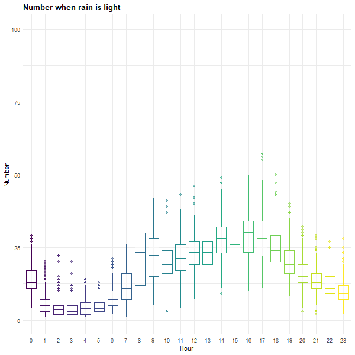

### Bad weather causes bad accident
  + A weather-related accident is defined as one that occurs in any adverse condition such as sleet, snow, rain, fog, winds or on slick pavement.If you want to know how bad weather increases driving accidents, please [click here](https://www.blumenshinelawgroup.com/how-bad-weather-increases-driving-accidents/).

```{r include=FALSE}
library(tidyverse)
library(plotly)
library(rvest)
library(readr)
library(viridis)
library(leaflet)
library(patchwork)
library(RColorBrewer)
library(corrplot)
library(animation)
knitr::opts_chunk$set(
	echo = TRUE,
	warning = FALSE,
	fig.width = 8, 
  fig.height = 6,
  out.width = "90%"
)
options(
  ggplot2.continuous.colour = "viridis",
  ggplot2.continuous.fill = "viridis"
)
scale_colour_discrete = scale_colour_viridis_d
scale_fill_discrete = scale_fill_viridis_d
theme_set(theme_minimal() + theme(legend.position = "bottom",plot.title = element_text(face = "bold")))
```


```{r include=FALSE}
data_2018 = 
  read_csv("./data/2018data.csv") %>% 
  janitor::clean_names() 
newnames = colnames(data_2018) %>% 
  str_replace("number_of_","") 
names(data_2018) = newnames

tidy_data = 
data_2018 %>% 
  mutate(
    date_complete = date 
  ) %>% 
  separate(date, into = c("month", "day", "year"), sep = "/") %>% 
  separate(time, into = c("hour", "minute"), sep = ":") %>%
  mutate(
    date_paste = as.Date(paste("2018",month,day,sep = "-"))
  ) %>% 
  select(-zip_code, -location, -on_street_name, -cross_street_name, -off_street_name,-collision_id,-year) %>% 
  rename("vehicle_type" = "vehicle_type_code_1",
         "cause" = "contributing_factor_vehicle_1") %>% 
  mutate( day = as.numeric(day),
          month = as.numeric(month),
          hour = as.numeric(hour),
          minute = as.numeric(minute),
          latitude = replace_na(latitude,0),
          vehicle_type = str_to_lower(vehicle_type)
  ) %>%
  filter( latitude != 0) %>% 
  drop_na(borough)

```


```{r, include=FALSE}
climate_df = 
  read_csv("./large_data/climate.csv") %>% 
  janitor::clean_names() %>% 
  select(date,hourly_dry_bulb_temperature,hourly_precipitation,daily_weather) %>%
  separate(date, into = c("date", "time"), sep = " ") %>% 
  mutate(
    date = as.Date(date)
  )
```


```{r,include=FALSE}
all_day_weather_df =
  climate_df %>% filter(time == "23:59:00") %>% 
  distinct(date,daily_weather) %>% 
  filter(!duplicated(date)) %>% 
  separate(daily_weather, into = c("weathertype", "other"), sep = 2) %>%
  mutate(
    weathertype = recode(weathertype,
                      "SN" = "snow",
                      "HZ" = "haze",
                      "RA" = "rain",
                      "FG" = "fog",
                      "BR" = "mist"
                      ),
    weathertype = replace_na(weathertype,"sunny")) %>% 
  select(-other)

collision_all = 
tidy_data %>% 
  group_by(date_complete) %>% 
  summarise(
    collision_event = n(),
    injured_event = sum(persons_injured != 0, na.rm = TRUE),
    killed_event = sum(persons_killed != 0, na.rm = TRUE)
  )

collision_weather = 
bind_cols(all_day_weather_df,collision_all) %>% 
  select(-date_complete)
```

```{r include=FALSE}
daily_weather_df = 
climate_df %>% 
  separate(time, into = c("hour", "minute","second"), sep = ":") %>% 
  separate(date, into = c("year","month", "day"), sep = "-") %>% 
  separate(hourly_precipitation, into = c("prep","other"), sep = 4) %>% 
  select(-minute,-second,-year,-daily_weather,-other) %>% 
  mutate(
    month = as.numeric(month),
    day = as.numeric(day),
    hour = as.numeric(hour),
    prep = replace_na(as.numeric(prep),0)
  )

daily_weather_final = daily_weather_df[rep(seq_len(nrow(daily_weather_df)), each = 3), ]

daily_collision_data = 
tidy_data %>% 
  select(month,day,hour,persons_injured,persons_killed) %>% 
  group_by(month,day,hour) %>% 
  summarise(
    accident = n(),
    injured = sum(persons_injured,na.rm = TRUE),
    killed = sum(persons_killed,na.rm = TRUE)
  ) %>% 
  pivot_longer(
    accident:killed,
    names_to = "type",
    values_to = "number"
  )

daily_weather_collision = 
  left_join(daily_collision_data, daily_weather_df,
            by = c("month","day","hour")) %>% 
  mutate(
    prep_degree = 
      if_else(prep %in% 0:0.10,"light",
              if_else( prep < 0.3 & prep > 0.11 , "moderate","heavy")),
  prep_degree = factor(prep_degree, levels =  c("heavy","moderate","light")))

daily_weather_plot =
daily_weather_collision %>% 
  ggplot(aes(hour, y = number, color = type)) +
  geom_point(alpha = 0.5) + 
  facet_grid(~prep_degree) +
  labs(
    color = "type",
    title = " Number by weather",
    y = "Number",
    x = "Hour"
    )
```

### Number of Accident by Degree of Precipitaion over a day

```{r message = FALSE, warning = FALSE, results='hide'}
daily_weather_collision = daily_weather_collision %>%
   mutate(hour = factor(hour, levels = c(0:23)))
daily_weather_plot = function(i){
daily_weather_collision %>% 
  filter(prep_degree == i) %>%
  filter(type == "accident") %>%
  ggplot(aes(x = hour, y = number, color = hour)) +
  geom_boxplot(alpha = 0.5) + 
  labs(
    color = "type",
    title = sprintf("Number when rain is %s",i),
    y = "Number",
    x = "Hour"
    ) +
  ylim(0,100) +
    theme(legend.position = "none")}
saveGIF({
  for (i in c("light","moderate","heavy"))
  {
    print(daily_weather_plot(i))
  }
}, movie.name = "weather.gif", ani.width = 600, ani.height = 600
)
```



*Comments:*

Extreme accidents happen during heavy/moderate precipitation as compared to light precipitation, which match our original hypothesis. If you go out and drive when rain is heavy, be careful, the possibility that huge collision happens also increases. 

### Number of Accident by Weather

```{r}
weather_type_plot =  
collision_weather %>% 
  group_by(weathertype) %>% 
  summarise(
    count = mean(collision_event)
  ) %>% 
  mutate(
    weathertype = fct_reorder(weathertype,count)
  ) %>% 
  ggplot(aes(x = weathertype, y = count,
             fill = weathertype)) + 
  geom_bar(stat = "identity", width = 0.6) +
  coord_flip()+
  labs(
    title = " Number of Accident by weather",
    y = "Number of Accident",
    x = "Weather Type"
    )
ggplotly(weather_type_plot)
```

*Comments:* 

It is surprising to see that sunny weather is the third most common weather type when car accidents tend to happen. On the other hand, people might be going outside more on sunny days, which can cause an increase in car accidents. Accident number in this plot is strongly related to how likely people will go out under different weather conditions. More people being outside means more accidents. 
